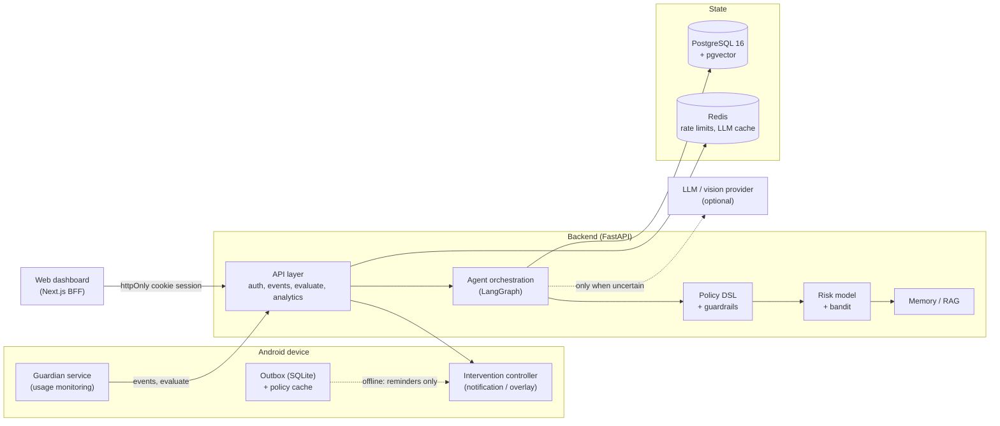
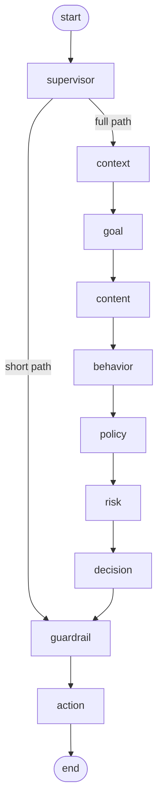

# Architecture

## System context



The device never decides on its own when it is online: it reports usage and asks the backend, which returns an
authorised command. When the backend is unreachable, the device falls back to cached rules and may only *remind*.

## Evaluation graph

Ten nodes; the supervisor takes a short path when the answer is already determined (emergency override, guardian
paused, essential app, missing consent), which keeps the common case cheap.



Each node is instrumented: inputs and outputs are summarised (secrets and raw content redacted) into `agent_steps`,
with latency and status, so any run can be replayed in the admin console.

## Decision pipeline

1. **Context** — sessions, focus state, overrides, daily totals and the behaviour profile for the user's timezone.
2. **Goal** — active goals decide what counts as useful; educational content for an exam is not distraction.
3. **Content** — only if the device sent text: local classifier first, LLM only when confidence < 0.55 and cloud
   consent exists. Injection detection quarantines the content and skips the model entirely.
4. **Behavior** — 14-day rolling profile: average session length, long-session rate, accept/override rates, trigger hours.
5. **Policy** — the user's compiled rules are evaluated deterministically, producing an effect, a winning rule and
   an escalation strategy.
6. **Risk** — 23 features → interpretable logistic rules blended with calibrated gradient boosting (`RISK_ML_WEIGHT`,
   default 0.6). Outputs distraction, doomscroll and continuation probabilities with a confidence and factor list.
7. **Decision** — the ladder maps risk band and policy effect to a recommended action and an eligible set. The LLM is
   consulted only when distraction risk falls in the ambiguity band (0.45–0.72) and more than one action is eligible;
   a contextual bandit picks among the eligible set when personalisation is enabled.
8. **Guardrails** — 14 deterministic checks authorise, soften or reject the proposal (see [agents](agents.md#guardrails)).
9. **Action** — builds a device command (title, body, duration, reversible actions, HMAC ticket, expiry) and records
   the intervention.

Feedback runs a separate graph: outcome → reward → bandit update → preference learning → memory write, with an
optional policy suggestion when the user keeps overriding the same rule.

## Attention score

A transparent heuristic (not a clinical measure), computed in `app/services/analytics.py`:

```
score = 0.35 · (1 − min(social ÷ limit, 1.5) ÷ 1.5)
      + 0.25 · (1 − long_session_rate)
      + 0.15 · (1 − night_share)
      + 0.15 · min(focus_minutes ÷ 120, 1)
      + 0.10 · intervention_acceptance_rate
```

rounded to 0–100. Every term is visible in the dashboard, so a user can see why the number moved.

## Component boundaries (section 52)

Six interfaces, all consumed through `AgentDeps` so an implementation can be replaced without touching agents or tools:
`LLMProvider`, `VisionProvider`, `EmbeddingProvider` (`app/providers/base.py`), `BehaviorModel`, `PolicyEngine`,
`InterventionController` (`app/interfaces.py`). `tests/agents/test_interfaces.py` swaps each one and asserts the
behaviour changes, so the abstraction is real rather than decorative.

## Performance and cost posture

- The device aggregates events and evaluates at most every two minutes per session; high-frequency events never
  reach cloud inference.
- The LLM is reached only in the ambiguity band, with a fast/reasoning model split, response cache, per-user daily
  token budget, monthly USD budget, timeouts, bounded retries and a fallback model.
- Vector search uses an HNSW cosine index on 384-dimension embeddings; analytics reads pre-aggregated daily features.
- Measured on this machine (1 CPU, SQLite, mock LLM): evaluation p50 103 ms, p95 661 ms including injected failures.
